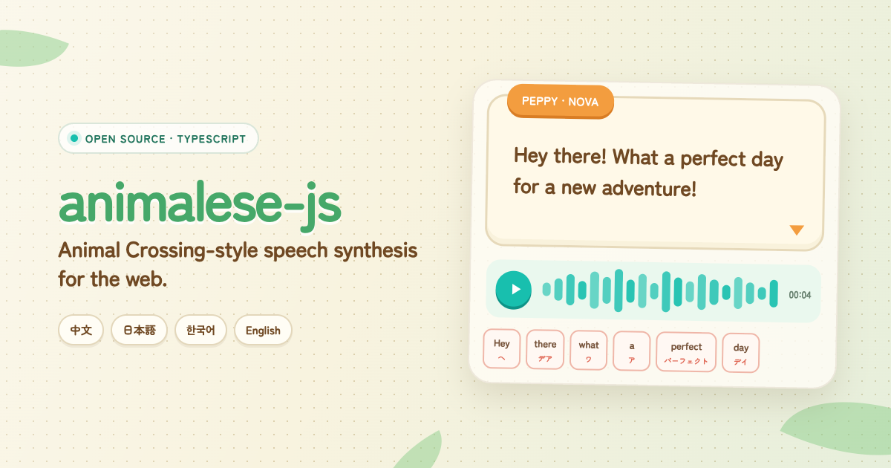
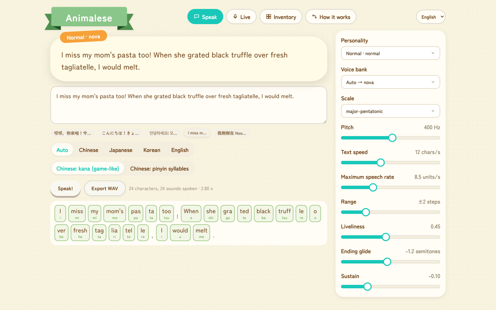
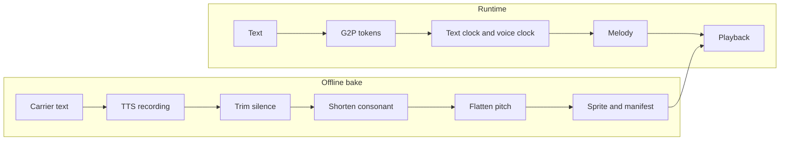

# `animalese-js`

[![License][license-src]][license-href]
[![Node.js][node-src]][node-href]
[![pnpm][pnpm-src]][pnpm-href]



`animalese-js` makes Animal Crossing style speech ("Animalese") in TypeScript. You give it text in Chinese, Japanese, Korean, or English. It gives you the babble that the villagers speak, in time with the dialogue box.

**Playground**



The work has two parts:

- An offline bake records the smallest sound units of each language with a TTS service, processes them, and packs them into voice banks.
- At runtime, the library splits the text into units, puts them on a timeline with a melody, and plays the banked units at a changed playback rate.

> We measured the timing and the pitch values on recordings of _Animal Crossing: New Horizons_. The splitting rules are a good approximation, not the original algorithm of the game.

<!-- START doctoc generated TOC please keep comment here to allow auto update -->
<!-- DON'T EDIT THIS SECTION, INSTEAD RE-RUN doctoc TO UPDATE -->
## Table of Contents

- [Getting Started](#getting-started)
- [Understand Animalese](#understand-animalese)
- [Packages](#packages)
- [Status](#status)
- [Development](#development)
- [Related](#related)
- [Acknowledgements](#acknowledgements)
- [License](#license)

<!-- END doctoc generated TOC please keep comment here to allow auto update -->

## Getting Started

### Prerequisites

- Node.js 24 or later
- pnpm 11 or later
- An OpenAI-compatible TTS endpoint, only if you bake your own voice banks

The packages are not on npm yet. Use them from this repository.

### Run the Playground

```sh
pnpm install
pnpm dev
```

Open the URL that Vite shows. The repository includes baked voice banks, so the playground works without a TTS endpoint.

### Speak in the Browser

```ts
import { createVoice, loadBanks, playSpeech, streamSpeech } from 'animalese'

const banks = await loadBanks('/banks/index.json')
const voice = createVoice(banks, { preset: 'peppy' })

// Browsers start audio only after a user gesture.
button.onclick = () => playSpeech(streamSpeech('哎呀，你来啦！', voice))
```

A voice has two parts:

- The settings: a preset, a preset with changes such as `{ preset: 'cranky', speed: 7 }`, or a full `VoiceOptions` object.
- The bank: a recorded voice. If you do not give `{ bank }` as the third argument, the voice uses the bank recorded closest to its pitch.

### Get the Speech in Other Forms

`streamSpeech()` gives a `ReadableStream` of chunks. Each chunk has mono samples and the marks of the tokens that appear while it plays. Use the chunks in one of these ways:

```ts
import { generateSpeech, playSpeech, streamSpeech, toMediaStream } from 'animalese'

// Play it, and reveal the text in time with the sound.
playSpeech(streamSpeech(text, voice), { onMark: mark => reveal(mark.end) })

// Get a MediaStream for an <audio> element, MediaRecorder, or WebRTC.
audio.srcObject = toMediaStream(streamSpeech(text, voice)).stream

// Get a WAV file.
const wav = await generateSpeech(text, voice)
```

`planSpeech(text, voice)` gives the tokens, the timeline, the selected bank, and the missing languages. It does not touch audio.

### Stream Text In

The text can also stream in, for example from an LLM or from speech recognition. The audio follows as the text arrives:

```ts
import { createVoice, playSpeech, streamSpeech, textStreamFromSpeechRecognition } from 'animalese'

// Chrome and Safari name it `webkitSpeechRecognition`.
const Recognition = window.SpeechRecognition ?? window.webkitSpeechRecognition
const recognition = new Recognition()
recognition.lang = 'zh-CN'
recognition.continuous = true

playSpeech(streamSpeech(textStreamFromSpeechRecognition(recognition), voice))
recognition.start()
```

`streamSpeech()` accepts a `string`, a `ReadableStream<string>`, or an `AsyncIterable<string>`. These rules apply to streamed text:

- The library speaks a word only after the word is complete, so a piece of text can stop in the middle of a word.
- If no text arrives for 500 ms (`idleMs`), the current sentence ends as if a full stop was typed. Then its last units can play.
- Speech recognition gives final results only. Speech that has played cannot be taken back.

### Change the Voice While It Speaks

Give `createVoice()` a function instead of an object. The library reads the function again before each unit. A signal, such as an `alien-signals` `computed`, works as is:

```ts
import { computed, signal } from 'alien-signals'

const pitch = signal(300)
const voice = createVoice(banks, computed(() => ({ preset: 'peppy', baseHz: pitch() })))

playSpeech(streamSpeech(text, voice))
pitch(500) // The units after this point use the higher pitch.
```

### Render in Node.js

The stream does not need Web Audio, so `generateSpeech()` works in Node.js too:

```ts
import { writeFile } from 'node:fs/promises'

import { loadBanksFromDirectory } from '@animalese/bake'
import { createVoice, generateSpeech } from 'animalese'

const banks = await loadBanksFromDirectory('apps/playground/public/banks')
const voice = createVoice(banks, { preset: 'cranky' })

await writeFile('hello.wav', await generateSpeech('嘿，过得还好吗？', voice))
```

The CLI does the same in one command:

```sh
pnpm say --text '嘿，过得还好吗？' --preset cranky --out hello.wav
```

### Compose the Steps Yourself

The lower-level packages give you each step: `analyze()` from `@animalese/g2p`, `createScheduler()` and `schedule()` from `@animalese/core`, and `createRenderer()` from `@animalese/dsp`. The `animalese` package connects these steps.

### Bake Voice Banks

Put the TTS credentials in an env file. Then bake the languages and voices that you want:

```sh
pnpm bake --env-file .env --lang zh,ja,ko --voice nova,onyx
```

The baker reads the credentials in this order:

1. `ANIMALESE_TTS_BASE_URL`, `ANIMALESE_TTS_API_KEY`, and `ANIMALESE_TTS_MODEL`
2. `TESTING_AUDIO_TTS_*`
3. `OPENAI_BASE_URL` and `OPENAI_API_KEY`

The baker keeps each raw recording in `.cache/tts`. When you bake again with different settings, it sends requests only for units that are not in the cache. TTS services sometimes return silence for one syllable. The baker rejects these recordings and records them again.

## Understand Animalese

This project uses the recipe of the [Animalese tutorial by 重轻](https://www.bilibili.com/video/BV1Mf4y1S7Gs):

1. Record the shortest sounds of a language, such as Chinese initials and finals.
2. Cut the recording into single sounds.
3. Trigger the sounds at random.
4. Raise the pitch.
5. Snap the pitch to a musical scale.

The tutorial does these steps by hand in a DAW. `animalese-js` does steps 1, 2, and the flat pitch offline. At runtime, it only splits text, plans the timeline and the melody, and changes the playback rate. All runtime steps work on streamed text: each step adds to its output as new text arrives.



### Voice Banks

A voice bank holds every unit of one language, recorded with one TTS voice:

| Language | Units | Carrier text for the recording |
| --- | --- | --- |
| Chinese | 402 toneless syllables, used only with `chinese: 'syllables'` | One common character for each syllable, from the first level of GB2312. The generator prefers characters with one reading, then the first tone. |
| Japanese | 101 kana morae, with yōon | The kana |
| Korean | 323 open syllables (19 initials × 17 vowels) | The syllable |
| English | No units of its own | English syllables use the nearest kana from the Japanese bank. |

By default, Chinese also uses the Japanese bank. Each pinyin syllable maps to the nearest kana: the initial selects the kana row, and the main vowel selects the column. The game has one shared Kana bank for all languages. Whole Mandarin syllables are too easy to understand, and Animalese is not meant to be understood. To use the Chinese bank, give `chinese: 'syllables'` to `streamSpeech()` or `generateSpeech()`.

The baker does these steps on each voiced unit:

1. It trims the silence at the start and the end.
2. It keeps a maximum of 30 ms of consonant before the voice starts.
3. It makes the pitch flat with TD-PSOLA, at the reference pitch of the bank. TD-PSOLA keeps the length and the formants.
4. It cuts the unit to a maximum length, adds fades, and sets the loudness.
5. It packs all units into one `sprite.wav`. The `manifest.json` file gives the position of each unit.

The reference pitch is the median pitch of the bank, rounded to a semitone. Because every unit has the same flat pitch, the runtime gets each note from one playback rate.

### Two Clocks

In the game, the dialogue box and the voice have different speeds. The text appears at the typing speed. The voice says a maximum number of units each second. On each tick, the voice says the latest character that appeared. The voice skips the characters that come faster than it can speak. It skips weak characters first, such as the Chinese neutral tone (的, 了, 吗) and English function words.

### Calibration

We measured these values on recordings of the Chinese and English versions of the game:

| Value | Chinese | English |
| --- | --- | --- |
| Text speed | 11–13 characters/s | 45–70 letters/s |
| Voice speed | 8–10 units/s | 13–14 units/s |
| Units for each character or syllable | 0.6–0.8 | 0.75–1 |

Other measured values:

- One unit lasts 70–140 ms. Its pitch is almost flat, with a small fall at the end.
- The pitch changes much between villagers: about 114 Hz for the cranky 罗博 (Lobo), 330 Hz for Marshal, 445 Hz for Derwin, and 500 Hz for 小桃.

Because of these differences, the voice options give the pitch in Hz. A low voice uses a bank recorded with a low voice (`onyx`). The library does not play a high recording at a slower rate.

The recordings do not show if the game selects the skipped characters on purpose, or if the voice is only too slow. We did not measure Japanese and Korean yet, so they use the Chinese pacing.

## Packages

| Package | Purpose |
| --- | --- |
| [`animalese`](https://github.com/moeru-ai/animalese-js/tree/main/packages/animalese) | Entry point: `loadBanks()`, `createVoice()`, `streamSpeech()`, `generateSpeech()`, and `planSpeech()`. It also exports the common parts of the other packages. |
| [`@animalese/core`](https://github.com/moeru-ai/animalese-js/tree/main/packages/core) | Types, voice presets, language pacing, the two clocks (`TextClock`, `VoiceClock`), the melody (`Melody`), and the incremental `createScheduler()`. It has no dependencies. |
| [`@animalese/g2p`](https://github.com/moeru-ai/animalese-js/tree/main/packages/g2p) | Language front ends: Chinese with `pinyin-pro`, Japanese with `wanakana`, Korean with `es-hangul`, and English syllables mapped to kana. It also routes mixed-script text and holds the unit inventories. |
| [`@animalese/dsp`](https://github.com/moeru-ai/animalese-js/tree/main/packages/dsp) | Audio processing in plain TypeScript: WAV, resampling, YIN pitch tracking, TD-PSOLA, unit preparation, sprite packing, and the streaming renderer. |
| [`@animalese/web`](https://github.com/moeru-ai/animalese-js/tree/main/packages/web) | Web Audio tools: `playSpeech()`, `toMediaStream()`, and `textStreamFromSpeechRecognition()`. |
| [`@animalese/bake`](https://github.com/moeru-ai/animalese-js/tree/main/packages/bake) | The baker: a cached recorder for OpenAI-compatible TTS, `bakeBank()`, `loadBanksFromDirectory()`, and the `animalese-bake` CLI. |

The [playground](https://github.com/moeru-ai/animalese-js/tree/main/apps/playground) uses Vite, React, React Router, Base UI, and [`animal-island-ui`](https://github.com/guokaigdg/animal-island-ui). It has four pages:

- **说话 (Speak)**: Type text and see the dialogue box appear with the voice. You can export WAV files.
- **实时 (Live)**: Speak into the microphone or type, and hear the babble as the text arrives. The voice changes while it speaks when you move a slider. The output can go to the speakers or to a `MediaStream`.
- **词表 (Inventory)**: See each unit on the syllable chart of its language, and listen to it.
- **原理 (Pipeline)**: See each step of the pipeline, with controls. The offline steps run the real DSP code in the browser, on built-in recordings or on your microphone.

## Status

`animalese-js` is early, and its APIs can change. These limits are known:

- Japanese kanji do not have a dictionary yet. Each kanji maps to a fixed kana, so the rhythm is correct but the reading is not.
- If mixed text has hiragana, the library reads Han characters as Japanese. Otherwise, it reads them as Chinese. For text such as 東京タワー, give `language: 'ja'`.
- A TTS service can read a Chinese carrier character with a different pronunciation. We did not listen to all 402 carriers.
- The voice banks are uncompressed 16-bit WAV, about 9 MB for each voice.

## Development

This repository is a pnpm workspace:

```sh
pnpm install
pnpm test:run
pnpm typecheck
pnpm lint
pnpm build
```

`pnpm lint` runs `moeru-lint`, which runs oxlint and then ESLint. The ESLint configuration follows [Project AIRI](https://github.com/moeru-ai/airi).

The table of contents in this README comes from `doctoc`. After you change the headings, run:

```sh
pnpm docs:toc
```

Research notes from the calibration (in Chinese) are in [`research/`](research/output/README.md).

## Related

> [!NOTE]
>
> This project is part of the [Project AIRI](https://github.com/moeru-ai/airi) ecosystem.

## Acknowledgements

- [重轻's Animalese tutorial](https://www.bilibili.com/video/BV1Mf4y1S7Gs) for the recipe
- [`izure1/animalese-tts`](https://github.com/izure1/animalese-tts) for the Japanese mora table
- [`Acedio/animalese.js`](https://github.com/Acedio/animalese.js) and [`stefanlegg/animalese-web`](https://github.com/stefanlegg/animalese-web)
- [`Xinqwq/Animalese_Converter`](https://github.com/Xinqwq/Animalese_Converter) (ChineseGibberish)
- [`pinyin-pro`](https://github.com/zh-lx/pinyin-pro), [`wanakana`](https://github.com/WaniKani/WanaKana), and [`es-hangul`](https://github.com/toss/es-hangul)
- [`animal-island-ui`](https://github.com/guokaigdg/animal-island-ui) and [ChillRound](https://github.com/Warren2060/ChillRound)

## License

[MIT](LICENSE)

[license-src]: https://img.shields.io/github/license/moeru-ai/animalese-js?style=flat&labelColor=0a0a0a&color=3b82f6
[license-href]: https://github.com/moeru-ai/animalese-js/blob/main/LICENSE
[node-src]: https://img.shields.io/badge/node-%3E%3D24-3b82f6?style=flat&labelColor=0a0a0a
[node-href]: https://nodejs.org/
[pnpm-src]: https://img.shields.io/badge/pnpm-11-3b82f6?style=flat&labelColor=0a0a0a
[pnpm-href]: https://pnpm.io/
